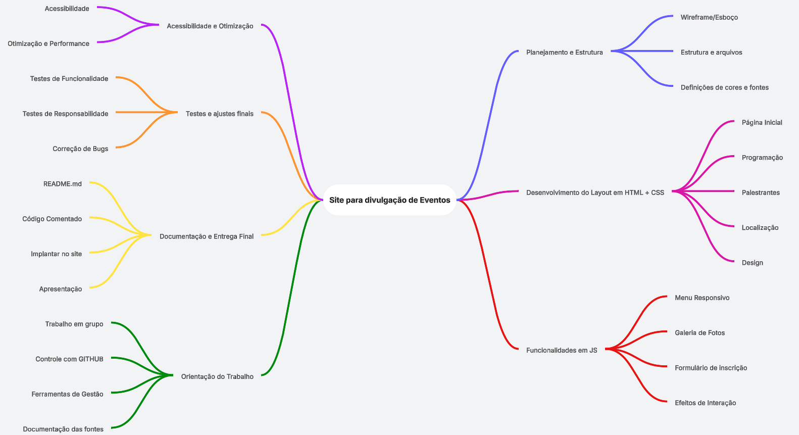
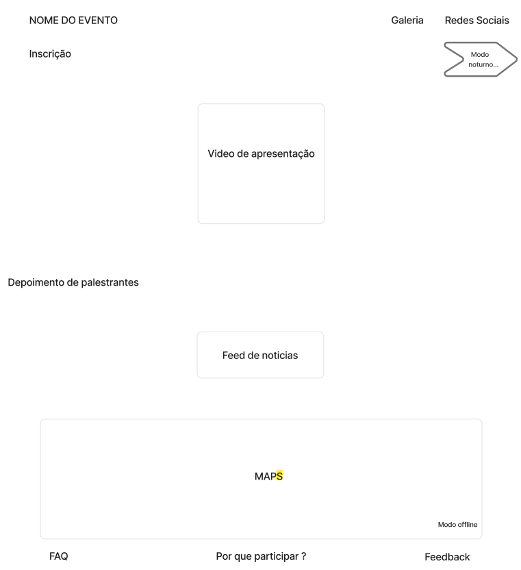

<h1 align="center">Projeto Tech - Divulgação GDG</h1>

## Descrição do projeto

### Objetivo Geral:

Desenvolver um site intuitivo e responsivo com a finalidade de divulgar e promover eventos, proporcionando um acesso facilitado às informações relevantes para o público e uma experiência dinâmica para os participantes.

### Objetivos Específicos:
- Criar uma plataforma de fácil navegação, permitindo que os organizadores do evento publiquem e editem de forma simples os detalhes sobre o evento, como data, local, descrição e programação.
- Implementar uma área de feedback, onde os participantes possam avaliar os eventos, compartilhar suas experiências e sugestões.
- Desenvolver uma galeria de fotos e vídeos, permitindo que os organizadores e palestrantes compartilhem imagens e momentos marcantes do evento.
- Incluir um formulário com validação de e-mail e campos obrigatórios, garantindo uma comunicação eficiente e sem erros de cadastro.
- Garantir a compatibilidade do site com dispositivos móveis, proporcionando uma experiência de navegação fluída e responsiva em smartphones e tablets.
- Adicionar um mapa interativo com a localização exata do evento, facilitando o acesso e a chegada dos participantes.

### Mapa mental do projeto

### Wireframe do projeto

### Linguagens de programação

``HTML5``: Será utilizado para a estruturação do conteúdo do site, criando as páginas e organizando as informações de forma semântica e acessível. O HTML proporcionará a base do site, garantindo que todos os elementos sejam corretamente dispostos.  
``CSS3``: Responsável pela estilização e layout do site. Utilizaremos o CSS para definir a aparência visual, como cores, fontes, espaçamento e responsividade, garantindo que o site tenha um design atraente e adaptável a diferentes tamanhos de tela.  
``Java Script``: Será utilizado para adicionar interatividade ao site, implementando funcionalidades como validação de formulários, animações, controle de navegação e outros recursos dinâmicos. O JavaScript também permitirá melhorar a experiência do usuário, tornando o site mais interativo e fluido.

# Autores

[ Guilherme Henrique  Silva](https://github.com/Guilherme-Henr-Silva) |  [ Deivid Aparecido  Galindo Oliveira](https://github.com/DeividGalindo) | [ Miguel Joaquim Marques  Clemente Souza](https://github.com/Miguel537)
| :---: | :---: | :---: |