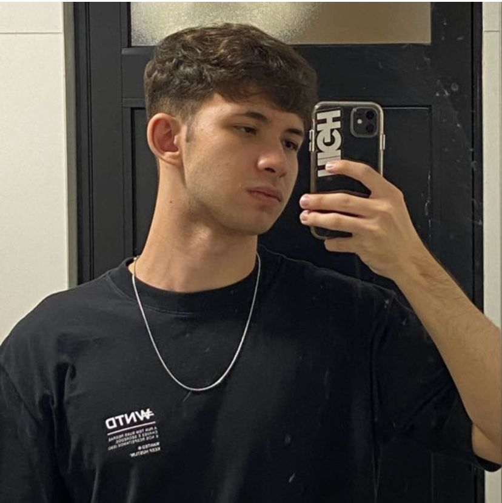

<h1 align="center">Projeto Tech - Divulgação GDG</h1>

## Descrição do projeto

WEB site feito para divulgação de um evento da GDG em Londrina feito em HTML5, CSS3 e Java Script

## Cabeçalho - Header 

Criado uma &lt;class&gt; dentro de uma &lt;div&gt; para estilização do cabeçalho da pagina.  
Nesta &lt;div&gt; contém as informações como nome, e-mail, telefone, linkedin e github.

## Seções - Section

Abaixo foi criado 4 seções &lt;section&gt; contendo:  
- Sobre mim;  
- Experiência profissional;  
- Formações acadêmicas;  
- Habilidades.

## Rodapé - Footer

E para o rodapé da pagina foi criado um &lt;footer&gt; contendo o simbolo de copyright (&copy;) e direitos autorais.

## Estilização com CSS3

As tags de estilização usadas foram:
- margin: Altera a margem da pagina;
- padding: Espaçamento entre o conteudo e a borda;
- font-family: Altera a fonte da escrita;
- background-color: Altera a cor de fundo da pagina;
- color: Altera a cor do texto;
- text-align: Alinhamento de texto;
- display:flex: Alteração de organização em blocos;
- align-items: Alinhamento dos conteudos;
- justify-content: 
- flex-direction: 
- width: Largura da imagem;
- height: Altura da imagem;
- border-radius: Arredonda a borda da imagem;
- border: Inclui borda na imagem;
- box-shadow: Caixa com sombreamento;

### Linguagens de programação

``HTML5``  
``CSS3``  
``Java Script``

# Autores

[ Guilherme Henrique Silva](https://github.com/Guilherme-Henr-Silva)  
[ Deivid Aparecido Galindo Oliveira](https://github.com/DeividGalindo)  
[ Miguel Joaquim Marques Clemente Souza](https://github.com/Miguel537)